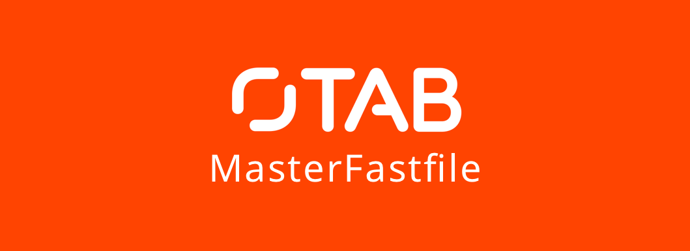

# MasterFastfile

[](https://github.com/theappbusiness/MasterFastfile/releases/tag/3.0.0)
[](https://github.com/theappbusiness/MasterFastfile/blob/master/LICENSE)

To setup your project to use the TAB MasterFastfile, navigate to your project root and run the following command:

```shell
curl https://raw.githubusercontent.com/theappbusiness/MasterFastfile/master/setup.sh | sh
```

Then setup your environments using the `.env` files created for you. To complete the setup just add the missing variable values.

To use the MasterFastfile add the following command to your Fastfile:

```ruby
import_from_git(url: 'https://github.com/theappbusiness/MasterFastfile.git', branch: '3.0.0', path: 'Fastfile')
```
For more detailed instructions [see our wiki](https://github.com/theappbusiness/MasterFastfile/wiki)

## Available lanes

* `test`
  * runs tests
* `ui_test`
  * runs ui tests
* `deploy_to_hockey`
  * runs tests
  * sets build number
  * installs provisioning profiles (if any are included in your Fastlane directory)
  * adds build info to app icon
  * builds and archives project
  * generates changelog from git commits
  * uploads app to hockey
* `deploy_to_hockey_no_test`
  * sets build number
  * adds build info to app icon
  * installs provisioning profiles
  * builds and archives project
  * generates changelog from git commits
  * uploads app to hockey
* `deploy_to_test_flight` (How do I find my iTunes Connect team ID? [link](https://github.com/fastlane/fastlane/issues/4301#issuecomment-253461017))
  * runs tests
  * sets build number
  * installs provisioning profiles
  * adds build info to app icon
  * builds and archives project
  * uploads app to test flight
* `local_build`
  * optionally adds icon overlay: e.g. `fastlane local_build icon_overlay:true`
  * installs provisioning profiles
  * builds an ipa

## Custom Actions

* `install_provisioning_profile`
  * Automatically installs any provisioning profiles included in your Fastlane directory

* `icon_overlay`
  * Adds overlay to app icon containing build information

For more detailed information on how to setup your project and environment please see our [wiki](https://github.com/theappbusiness/MasterFastfile/wiki)

## Provfiles

If you wish to support multiple extensions in your application using different provisioning profiles you will need to define a Provfile. In your Provfile you define your separate target names (aka MyApp, MyWatchExtension) and the provisioning profile name to be used with them e.g.

```
target 'MyApp' do
  "MyAppProvisioningProfileName"
end

target 'MyWatchExtension' do
  "MyWatchExtensionProvisioningProfileName"
end

target 'MyOtherExtension' do
  # MY_OTHER_EXTENSION_PROFILE_NAME could be defined in a .env file allowing support for multiple environments.
  ENV['MY_OTHER_EXTENSION_PROFILE_NAME']
end
```

## Dependencies

### Imagemagick
Install using brew
```shell
brew install imagemagick
```
### Ghostscript
Install using brew
```shell
brew install ghostscript
```

## License

This project is licensed under the terms of the MIT license. See the [LICENSE](LICENSE) file.
